# ReviewGuard MVP - 마스터 아키텍처 및 시스템 명세서 (MASTER_ARCHITECTURE.md)

> **경고 (WARNING)**: 본 문서는 ReviewGuard 프로젝트의 핵심 비즈니스 로직, 라우팅 규칙, 권한 체계 및 결제 처리 파이프라인을 정의한 최상위 설계 문서입니다. 프로젝트 내의 어떤 코드를 수정하더라도 본 문서에 명시된 규칙을 위반해서는 안 되며, 위반 시 심각한 회귀 버그(Regression Bug) 및 보안 취약점이 발생할 수 있습니다.

---

## 1. 권한 체계 (Role-Based Access Control) 및 DB 스키마

ReviewGuard는 매장 중심(Store-centric)의 B2B SaaS 플랫폼으로 개편되는 과정에서, **유저의 시스템 권한(Role)**과 **개별 매장의 요금제(Subscription Plan)**를 결합하여 권한을 제어하는 하이브리드 통제 구조를 채택하고 있습니다.

### 1.1 유저 권한 (user_roles.role) ENUM 및 역할 정의
`user_roles` 테이블의 `role` 컬럼은 데이터베이스에 정의된 `user_role_type` ENUM을 준수하며, 정확한 스펠링과 정의는 다음과 같습니다.

*   **`SUPER_ADMIN`**: 시스템 최고 관리자. RLS(Row Level Security)를 완전히 우회하여 모든 조직(Organization) 및 매장(Store) 데이터를 조회, 생성, 수정, 삭제할 수 있습니다.
*   **`HQ_ADMIN`** (코드 내에서 **`hq`**와 혼용되어 체크됨): 프랜차이즈 본사(조직) 관리자. 소속된 `organization_id` 하위의 모든 가맹점 데이터를 열람하고, 본사 통합 대시보드 및 경쟁사 엑스레이(`CompetitorXRay`)에 접근할 수 있습니다.
*   **`STORE_OWNER`**: 일반 매장 소유주. 요금제 컬럼이 분리되기 이전의 기본 역할값이며, 일반적인 매장 사장님 계정을 의미합니다.

### 1.2 매장 요금제 (stores.subscription_tier) 등급 정의
과금 방식이 매장 단위로 관리되도록 개편됨에 따라, 요금제는 `stores` 테이블의 `subscription_tier` (`TEXT` 타입, 기본값 `'FREE'`) 컬럼에 저장됩니다.

*   **`FREE`**: 무료 체험(Trial) 등급. 회원가입 시 기본 제공되며, 최초 매장 등록 후 14일 동안 제한적으로 일부 기능을 사용해볼 수 있습니다.
*   **`BASIC`**: 베이직 구독 등급. 네이버 플레이스 리뷰 연동, 테이블 텐트 신청, 비밀 소리함, 맞춤형 AI 리뷰 답글 수동 생성 등의 기본 기능이 해제됩니다.
*   **`PRO`**: 프로 구독 등급. 베이직 기능에 더해 상권 내 타겟 키워드 자동 분석(AI 키워드 추출), 경쟁사 플레이스 트래픽 추격 레이더, 실시간 부정 리뷰 알림, 경쟁사 대비 매장 성장률 분석 리포트 등의 고급 데이터 분석 툴이 활성화됩니다.
*   **`ENTERPRISE`**: 엔터프라이즈 구독 등급. 프랜차이즈 전용 요금제로, 본사 통합 관제 대시보드와 가맹점간 실시간 데이터 동기화 기능이 제공됩니다.

### 1.3 신규 회원가입 시 DB Trigger 자동화 프로세스
신규 유저가 회원가입을 완료하여 `auth.users` 테이블에 새로운 사용자가 Insert되면, 다음과 같은 데이터베이스 자동화 파이프라인이 실행됩니다.

1.  **트리거 발동**: `auth.users` 테이블에 새로운 행이 추가되면 `on_auth_user_created` 트리거가 실행됩니다.
2.  **함수 실행**: 트리거에 의해 `public.handle_new_user()` PL/pgSQL 함수가 호출됩니다.
3.  **기본 데이터 삽입**: `public.user_roles` 테이블에 해당 유저의 `user_id`를 삽입하며, 기본값으로 **`role = 'STORE_OWNER'`**를 설정합니다. 과금 정책 및 만료 기한(`subscription_tier`, `subscription_expires_at`)은 유저 역할이 아닌 개별 매장 단위로 관리되므로 `user_roles` 테이블에는 별도의 구독 기한 컬럼이나 `FREE` 역할이 존재하지 않으며, 점주가 온보딩 과정에서 매장을 생성할 때 `stores` 테이블에 기록 및 연동됩니다.
4.  **매장 정보 연동**: 일반 점주가 매장을 생성할 때, 해당 매장의 `subscription_tier`는 기본값 `'FREE'`로 지정되며, `trial_start_date`가 생성 시점의 타임스탬프로 기록됩니다.

---

## 2. 미들웨어 라우팅 룰 (`middleware.ts` 핵심 교통정리)

Next.js 미들웨어(`lib/supabase/middleware.ts`)는 사용자 인증 상태와 권한, 매장 유무를 최전선에서 판별하여 정교한 교통정리를 수행합니다.

### 2.1 상태별/권한별 리다이렉트 상세 흐름 (Flow)

```mermaid
graph TD
    A[사용자 요청 진입] --> B{로그인 세션 존재 여부}
    
    B -- 미인증 유저 --> C{보호된 경로 접근?}
    C -- /dashboard, /onboarding, /hq --> D[url.search 쿼리 보존 후 /login 리다이렉트]
    C -- 기타 퍼블릭 경로 --> E[통과]
    
    B -- 인증 완료 유저 --> F{/login 접근?}
    F -- 예 --> G[/dashboard 리다이렉트]
    F -- 아니오 --> H{유저 권한 평가}
    
    H -- SUPER_ADMIN --> I{/super-admin 접근?}
    I -- 예 --> J[통과]
    I -- 아니오 --> K[/super-admin 리다이렉트]
    
    H -- HQ 권한 (HQ_ADMIN / hq) --> L{/dashboard, /onboarding, /pricing 접근?}
    L -- 예 --> M{/dashboard 이면서 storeId 존재?}
    M -- 예 --> N[통과 (HQ 가맹점 프리패스)]
    M -- 아니오 --> O[/hq 강제 리다이렉트]
    L -- 아니오 --> P{/hq 접근?}
    P -- 예 --> Q[통과]
    P -- 아니오 --> R[통과]
    
    H -- 일반 사장님 (FREE/BASIC/PRO 등) --> S{/hq 접근?}
    S -- 예 --> T[/dashboard 강제 리다이렉트]
    S -- 아니오 --> U{/dashboard, /onboarding, /pricing 접근?}
    U -- 예 --> V{stores 테이블 조회 (hasStore)}
    V -- 매장 없음 --> W{접근 경로가 /dashboard 또는 /pricing?}
    W -- 예 --> X[/onboarding 강제 리다이렉트]
    W -- 아니오 --> Y[통과]
    V -- 매장 있음 --> Z{접근 경로가 /onboarding?}
    Z -- 예 --> AA[/dashboard 강제 리다이렉트]
    Z -- 아니오 --> AB[통과]
    U -- 아니오 --> AC[통과]
```

#### ① 미인증 유저 (비로그인 상태)
*   보호 경로(`/dashboard`, `/onboarding`, `/hq` 등)에 접근 시 -> 즉시 **/login 페이지로 강제 리다이렉트**합니다.
*   **핵심**: 이때 원래 URL에 붙어 있던 모든 쿼리 파라미터(특히 `?token=...`)를 유실하지 않도록 복제하여 리다이렉트 경로 뒤에 부착합니다 (`url.search = request.nextUrl.search`).

#### ② 로그인 완료된 유저가 `/login` 진입 시
*   이미 인증을 마친 유저가 로그인을 다시 시도하면, 즉시 **/dashboard로 리다이렉트** 처리합니다.

#### ③ SUPER_ADMIN (최고 관리자)
*   API, 넥스트 정적 경로(`_next`), 이미지 및 에셋 요청을 제외한 일반 페이지 요청의 경우, `/super-admin` 하위 경로에 있지 않다면 **무조건 `/super-admin`으로 강제 리다이렉트**합니다.

#### ④ HQ_ADMIN / hq (본사 관리자)
*   **프리패스 예외**: 본사 관리자가 가맹점 관리를 위해 `/dashboard`에 접근하고, 쿼리 스트링에 `storeId`가 부착되어 있는 경우 -> 미들웨어에서 매장의 본사 소속 여부를 조회하고 검증한 뒤 리다이렉트하지 않고 **통과(Pass)**시킵니다.
*   그 외에 `/dashboard`에 `storeId`가 없이 진입하거나, `/onboarding`, `/pricing`에 접근하는 경우 -> **무조건 `/hq` (본사 대시보드)로 리다이렉트**하여 일반 점주용 온보딩 및 구독 페이지 노출을 전면 차단합니다.

#### ⑤ 일반 사장님 유저 (HQ 권한 없음)
*   본사 관리자용 경로인 `/hq`에 접근 시 -> **무조건 `/dashboard`로 튕겨냅니다**.
*   **온보딩 미완료 유저 (매장 데이터 없음)**: `/dashboard` 또는 `/pricing`에 접근을 시도하면 -> **무조건 `/onboarding`으로 강제 이동**시킵니다.
*   **온보딩 완료 유저 (매장 데이터 존재)**: 이미 매장을 보유한 유저가 `/onboarding`에 재인입되면 -> **무조건 `/dashboard`로 강제 리다이렉트**하여 이중 매장 생성을 방어합니다.

### 2.2 쿼리 파라미터(Token) 생존 보장 로직
미들웨어 내에서 발생하는 모든 `NextResponse.redirect(url)` 처리 직전에는 아래의 코드가 반드시 실행됩니다.
```typescript
url.search = request.nextUrl.search;
```
이 코드는 프랜차이즈 본사 초대 링크 등에서 제공되는 고유 인증 토큰(`?token=...`)이 회원가입 및 미인증 리다이렉트 과정 중 유실되지 않고 최종 목적지까지 살아남아 세션 스토리지에 저장될 수 있도록 보장합니다.

---

## 3. 프론트엔드 라우팅 및 폴더 구조 (Pages & Routing)

### 3.1 주요 페이지 물리적 디렉토리 경로
각 웹 페이지는 Next.js App Router 규칙에 따라 다음과 같은 구조로 마운트되어 있습니다.

*   **로그인 / 회원가입**: `app/login/page.tsx`
    *   이메일/비밀번호 기반 로그인 처리 및 신규 회원가입 모달, 이메일 인증 안내 UI 포함.
*   **온보딩 (매장 등록)**: `app/onboarding/page.tsx`
    *   상호명, 사업자번호(10자리 정규식 검증), 영업신고번호 입력 폼을 렌더링하며 본사 초대 토큰 수락 프로세스를 수행.
*   **사장님 대시보드**: `app/dashboard/page.tsx`
    *   일반 점주용 대화형 통합 뷰어. `<DashboardViewWrapper />`를 주축으로 배치.
*   **본사 통합 대시보드**: `app/hq/page.tsx`
    *   프랜차이즈 본사 통합 관제 시스템. `<HQOverview />` (통합 요약)와 `<CompetitorXRay />` (경쟁사 분석) 컴포넌트로 구성.
*   **요금제 및 결제 안내**: `app/pricing/page.tsx`
    *   Free, Basic, Pro, Enterprise 요금 카드 및 본사 지원(대납) 매장 여부 체크.
*   **결제 진입점**: `app/checkout/page.tsx`
    *   토스 페이먼츠 결제 위젯 렌더링 및 결제 승인 요청.
*   **결제 완료 페이지**: `app/payment/success/page.tsx`
    *   결제 성공 확인 및 서버 액션을 통한 가맹점 등급 업그레이드 처리.

### 3.2 `/hq` 페이지 권한 방어 로직
Next.js 미들웨어와 더불어, `/hq` 페이지 컴포넌트(`app/hq/page.tsx`) 내부 서버 사이드 렌더링(SSR) 단계에서 2차 검증을 수행합니다.
```typescript
const { data: roleData } = await supabase
  .from("user_roles")
  .select("role, organization_id")
  .eq("user_id", user.id)
  .maybeSingle();

const userRole = roleData?.role || 'STORE_OWNER';

if (userRole !== 'HQ_ADMIN' && userRole !== 'SUPER_ADMIN') {
  redirect("/dashboard");
}
```
*   **주의 사항**: 온보딩 페이지(`app/onboarding/page.tsx`) 완료 시점에 사용자의 역할이 `HQ_ADMIN`인 경우 `router.replace("/hq/dashboard")`로 페이지를 이동하게 되어 있으나, 현재 코드베이스의 물리적 페이지 경로는 `/hq/page.tsx`로 매핑되어 있습니다. 미들웨어의 접두사 검사(`/hq`로 시작하는 경로 매칭)에 의해 에러가 방지되지만, 경로 작성 시 유의해야 합니다.

---

## 4. 토큰 및 세션 관리 (인증 파이프라인)

본사에서 발급한 프랜차이즈 가맹점 초대 일회성 토큰(`?token=...`)의 캡처부터 최종 소비까지의 프론트엔드 생명주기(Lifecycle)는 아래와 같이 동작합니다.

```mermaid
sequenceDiagram
    actor User as 가맹점주
    participant Login as 로그인 페이지 (/login)
    participant Session as 브라우저 SessionStorage
    participant Onboarding as 온보딩 페이지 (/onboarding)
    participant DB as Supabase DB
    
    User->>Login: 1. 초대 링크 진입 (/?token=TOKEN_VALUE)
    Note over Login: useEffect: URL의 token 파라미터 감지
    Login->>Session: 2. sessionStorage.setItem("hq_invite_token", token)
    User->>Login: 3. 로그인/회원가입 완료
    Login->>Session: 4. 토큰 조회 (getItem)
    Login->>User: 5. /dashboard?token=TOKEN_VALUE 이동 (미들웨어가 /onboarding?token=...으로 리다이렉트)
    
    Note over Onboarding: useEffect: URL 파라미터 및 sessionStorage 양방향 검사
    Onboarding->>User: 6. 본사 정보 위임 필수 동의 체크박스 활성화
    User->>Onboarding: 7. 동의 후 가맹점 정보 입력 및 제출
    
    rect rgb(20, 20, 30)
        Note over Onboarding: handleSubmit (초대장 유효성 및 트랜잭션 검증)
        Onboarding->>DB: 8. hq_invites 조회 (status = PENDING 검증)
        DB-->>Onboarding: 검증 완료
        Onboarding->>DB: 9. hq_invites 상태 업데이트 (status = USED)
        Onboarding->>DB: 10. stores 테이블에 가맹점 등록 (is_hq_sponsored = true, organization_id 등록)
    end
    
    Onboarding->>Session: 11. sessionStorage.removeItem("hq_invite_token")
    Onboarding->>User: 12. 등록 완료된 매장 ID 기반 대시보드로 이동
```



1.  **초대 토큰 포획 (`app/login/page.tsx`)**:
    *   가맹점주가 `?token=...` 형태의 초대 링크로 로그인 페이지에 진입하면, `useEffect` 훅이 동작하여 URL의 토큰 값을 가로채 브라우저의 `sessionStorage`에 `"hq_invite_token"` 키로 백업합니다.
2.  **로그인 성공 및 쿼리 파라미터 복원**:
    *   인증이 성공하면 `sessionStorage`에서 백업된 토큰의 유무를 판별합니다.
    *   토큰이 존재할 경우 일반 `/dashboard`로 이동하는 대신, 토큰 파라미터를 강제로 덧붙인 `/dashboard?token=...`으로 리다이렉트시킵니다. (이후 미들웨어에 의해 자동으로 `/onboarding?token=...` 페이지로 토큰을 흘려보냅니다).
3.  **동적 UI 구성 (`app/onboarding/page.tsx`)**:
    *   온보딩 컴포넌트는 최초 렌더링 시 URL 쿼리 파라미터와 `sessionStorage`에 저장된 토큰 정보를 모두 검사하여 `token` 상태값을 유지합니다.
    *   토큰이 확인되면, 폼 하단에 **"[필수] 프랜차이즈 본사(HQ)의 매장 데이터 열람 및 관리 권한 위임에 동의합니다."** 라는 동의 박스를 노출합니다.
    *   이 체크박스가 체크되어 `hq_access_consent` 값이 `true`가 되어야만 온보딩 제출 버튼(`isFormValid`)이 비활성 상태에서 활성 상태로 변경됩니다.
4.  **초대장 검증 및 DB 트랜잭션**:
    *   가맹점 등록 양식을 제출하면 백엔드 단에서 `hq_invites` 테이블에 해당 토큰이 실제로 존재하고 `status === 'PENDING'`인지 조회합니다.
    *   유효한 초대장일 경우, `hq_invites` 레코드의 `status`를 `'USED'`로 교체하여 초대장을 1회성으로 완전 소비합니다.
    *   이후 `stores` 테이블에 새 가맹점 정보를 삽입할 때 `organization_id`와 `is_hq_sponsored = true`, `hq_access_consent = true`를 바인딩하여 본사 대납 및 데이터 제공 관계를 맺습니다.
5.  **세션 청소 및 만료**:
    *   매장 정보 Insert 및 역할 체크가 성공적으로 완료되면, 브라우저 스토리지의 오염을 방지하기 위해 `sessionStorage.removeItem("hq_invite_token")`을 호출하여 토큰을 메모리에서 영구히 폐기한 후 최종 대시보드로 이동합니다.

---

## 5. 결제 및 요금제 렌더링 룰 (Toss / UI Blur)

ReviewGuard는 결제 만료 유저를 미들웨어 레벨에서 `/pricing`으로 강제 리다이렉트하는 대신, 사용성을 보존하기 위해 **대시보드 통과 후 프론트엔드 컴포넌트 단에서 UI 차단(Blur 및 비활성화)을 수행**하는 방식을 채택하고 있습니다.

### 5.1 결제 만료 배너 표시 룰 (`ExpirationBanner.tsx`)
대시보드 최상단에 고정 렌더링되는 컴포넌트로서, 매장의 유효 상태를 판별하여 안내 문구를 제공합니다.

*   **즉시 숨김 조건**:
    *   결제 성공 콜백을 통해 대시보드로 복귀한 유저의 경우, URL에 `payment_success=true` 파라미터가 감지됩니다. 이 때 `isJustPaid` 상태가 `true`로 설정되며, 배너는 DB 조회 결과를 무시하고 **즉시 숨김(`null` 리턴)** 처리됩니다.
*   **만료 판단 공식**:
    *   매장 데이터의 `trial_start_date`를 기준으로 14일 무료 체험 기간이 경과했거나, `subscription_expires_at` 날짜가 현재 시각을 초과한 경우 만료(`isExpired = true`)로 간주합니다.
*   **출력 문구 및 결제 유도 분기**:
    *   **HQ_ADMIN / SUPER_ADMIN**: "가맹점 결제가 만료되었습니다." 문구 노출 및 `/pricing` 결제 링크 노출.
    *   **본사 지원 가맹점 (`is_hq_sponsored` 가 true인 경우)**: "프랜차이즈 본사 통합 결제가 만료되어 QR 및 기능이 제한되었습니다. 본사 담당자에게 문의해 주세요." 문구를 렌더링하되, 개별 점주가 직접 결제할 수 없도록 **결제 페이지 이동 버튼을 완전히 숨김** 처리합니다.
    *   **일반 사장님**: "결제가 만료되어 기능이 제한되었습니다." 문구를 노출하며 연장 결제하기 버튼을 활성화합니다.

### 5.2 UI Blur 및 기능 접근 제한 (Gating)
만료된 사용자 및 요금제 미달 사용자는 화면을 가리는 방식으로 접근을 제한합니다.

*   **제한 조건 판단 (`isProUser`)**:
    *   `isProUser = !isExpired && (["PRO", "ENTERPRISE", "HQ_ADMIN", "SUPER_ADMIN"].includes(activeRole) || isHqStore)`
    *   구독 기간이 만료되지 않은 상태에서 사용자의 역할이 PRO 이상이거나, 본사 지원 가맹점인 경우에만 PRO 등급 권한이 보장됩니다.
*   **블러(Blur) 및 모달 팝업 차단**:
    *   키워드 매니저(`KeywordManager.tsx`), QR 코드 다운로드(`QRCodeWidget.tsx`), AI 답글 생성기(`ManualReplyGenerator.tsx`), 성장 분석 대시보드(`ProAnalyticsViewWrapper.tsx`) 등 핵심 위젯 내부에서 `isExpired` 값이 참일 경우 동작이 방어됩니다.
    *   작업(다운로드, 저장, 생성 등) 클릭 시 즉시 작업을 차단하고 `<PaywallModal />`을 팝업 형태로 출력하여 요금제 업그레이드를 유도합니다.
    *   **PaywallModal 분기**: 매장이 `isHqStore` (본사 소속)인 경우 "🔒 통합 결제 만료" 타이틀과 "프랜차이즈 통합 결제가 만료되었습니다. 본사 담당자에게 문의해 주세요." 메시지를 띄우고, 일반 매장일 경우 "🔒 결제 필요" 타이틀과 "베이직 플랜 전용 기능입니다. 업그레이드하고 모든 기능을 사용해보세요." 메시지를 제공합니다.

### 5.3 Toss Payment 성공 및 DB 동기화 파이프라인
결제 직후 데이터베이스 지연 및 세션 동기화 문제를 극복하기 위해 구현된 인증 갱신 핫라인입니다.

```mermaid
sequenceDiagram
    actor Owner as 사장님
    participant Toss as 토스 결제 위젯
    participant Success as 결제 완료 페이지 (/payment/success)
    participant Action as upgradeStoreTier (Server Action)
    participant DB as Supabase DB
    participant Dashboard as 대시보드 (/dashboard)

    Owner->>Toss: 1. 결제 승인 요청
    Toss->>Success: 2. 성공 리다이렉트 (?plan=pro&storeId=STORE_ID)
    Success->>Action: 3. upgradeStoreTier(plan, storeId) 실행
    
    rect rgb(30, 20, 20)
        Note over Action: Raw REST API Patch (RLS 우회)<br/>Service Role Key 인증 강제 주입
        Action->>DB: 4. stores.subscription_tier = 'PRO'<br/>subscription_expires_at = NOW() + 30일
    end
    
    Action-->>Success: 5. 업그레이드 성공 응답
    Note over Success: DB 복제 지연 극복 대기<br/>await Promise (150ms)
    Success->>Dashboard: 6. window.location.href (Hard Navigation)<br/>/dashboard?payment_success=true&plan=PRO&t=TIMESTAMP
    
    Note over Dashboard: 서버 컴포넌트 마운트 시<br/>payment_success 확인
    Dashboard->>DB: 7. createAdminClient()로 캐시 없이 실시간 Role 조회
    DB-->>Dashboard: freshRole 반환
    Dashboard->>Owner: 8. ExpirationBanner 비노출 및 해제된 UI 즉시 렌더링
```



1.  **결제 성공 및 서버 액션 호출**:
    *   사용자가 `CheckoutPage`에서 결제를 성공시키면 `/payment/success?plan=...&storeId=...` 페이지로 라우팅되고, `upgradeStoreTier` 서버 액션이 실행됩니다.
2.  **JWT 오염 및 권한 우회 (Raw Patch)**:
    *   Supabase 클라이언트가 가지는 유저 JWT 만료 정보 캐싱 오류를 방지하기 위해, 서버 액션 내에서 Supabase 라이브러리를 거치지 않고 **`SUPABASE_SERVICE_ROLE_KEY` 마스터 키를 직접 헤더에 주입하여 Supabase REST API로 직접 PATCH 요청**을 전송합니다.
    *   매장의 `subscription_tier = targetRole`, `subscription_expires_at`을 현재 시간 기준 +30일(FREE의 경우 +14일)의 ISO 문자열로 강제 업데이트합니다.
3.  **캐시 파괴 및 대기 (Replication Lag)**:
    *   서버 액션 성공 시 `revalidatePath`를 통해 대시보드와 HQ 레이아웃의 Next.js 라우터 캐시를 강제 파괴합니다.
    *   클라이언트 단에서는 DB 복제본이 마스터 DB와 완벽히 동기화될 수 있도록 **150밀리초(0.15초)**의 인위적인 대기 시간을 가집니다.
4.  **하드 네비게이션 및 실시간 갱신**:
    *   대기 완료 후 `window.location.href`를 통한 하드 리로드(Hard Navigation) 방식으로 대시보드로 이동합니다 (`payment_success=true` 및 갱신 플랜 정보 포함).
    *   대시보드 서버 컴포넌트(`app/dashboard/page.tsx`)는 `payment_success === "true"` 파라미터가 포착되면 캐시된 Supabase 세션을 완전히 무시하고 **`createAdminClient()`를 동적으로 생성하여 실시간으로 DB에서 최신 권한을 조회(freshRole)**한 후 프론트엔드 컴포넌트에 즉시 주입합니다.
    *   클라이언트 단 wrapper(`DashboardViewWrapper.tsx`)는 전달받은 최신 권한 및 URL 상태를 기준으로 화면 블러와 만료 배너를 즉각 지우고 활성화 상태의 대시보드를 즉시 노출합니다.
